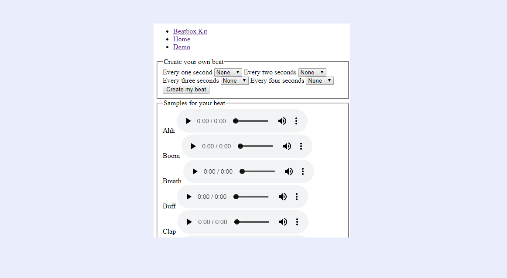

<h1 align="center">Browser Technologies @cmda-minor-web 1819</h1>

<p align="center"><b>A demo based on the use case: I want to be able to beatbox; with the aim that all users, with all browsers, can see or hear at least the core functionality in every context.</a>.</b>
</p>

<br>

<p align="center">
  <a href="https://browser-technologies-1819.herokuapp.com/">
    
  </a>
  &nbsp;&nbsp;&nbsp;
  <a href="https://browser-technologies-1819.herokuapp.com/">
    
  </a>
  &nbsp;&nbsp;&nbsp;
  <a href="https://browser-technologies-1819.herokuapp.com/">
    
  </a>
  &nbsp;&nbsp;&nbsp;
  <a href="https://browser-technologies-1819.herokuapp.com/">
    
  </a>
  &nbsp;&nbsp;&nbsp;
  <a href="https://github.com/Mennauu/browser-technologies-1819/blob/master/LICENSE">
    
  </a>
</p> 

<br>


<br>

<!-- ☝️ replace this description with a description of your own work -->
## Introduction
This Beat Box Kit is made as part of a course from [@cmda-minor-web 18-19](https://github.com/cmda-minor-web/browser-technologies-1819). In this course I had to make a website with the aim that all users, with all browser can see the core functionality. The idea was to build the website based on [progressive enhancement](https://developer.mozilla.org/en-US/docs/Glossary/Progressive_Enhancement).

Some resources possess an emoticon to help you understand which type of content you may find:

- 📖: Documentation or article
- 🛠: Tool or library
- 📹: Video

<!-- Maybe a table of contents here? 📚 -->
## Table of Contents

- [Installation](#installation)
- [Feature research](#feature-research)
  - [JavaScript](#javascript)
    - [Problems](#problems)
    - [How to achieve](#how-to-achieve)
    - [Examples](#examples)
  - [Broadband](#broadband)
    - [Problems](#problems)
    - [How to achieve](#how-to-achieve)
    - [Examples](#examples)
  - [Implementations](#implementations)
    - [Turn off images](#turn-off-images)
    - [Disable custom fonts](#disable-custom-fonts)
    - [Disable JavaScript](#disable-javascript)
    - [Turn off colors](#turn-off-colors)
    - [Turn off broadband internet](#turn-off-broadband-internet)
    - [Cookies](#cookies)
    - [LocalStorage doesn't work](#localstorage-doesnt-work)
    - [Mouse and trackpad don't work](#mouse-and-trackpad-dont-work)
- [Checklist](#checklist)
- [Credits](#credits)
- [Sources](#sources)
- [License](#license)

<!-- How about a section that describes how to install this project? 🤓 -->
## Installation
1. Open your terminal
2. Change the directory to a folder in which you want to place the files
```bash
cd /~path
```
3. Clone the repository (you're going to need [Git](https://www.linode.com/docs/development/version-control/how-to-install-git-on-linux-mac-and-windows/))
```bash
git clone https://github.com/Mennauu/browser-technologies-1819
```
4. Change directory to repository
```bash
cd browser-technologies-1819
```
5. Install dependencies from [package.json](https://github.com/Mennauu/browser-technologies-1819/blob/master/package.json)
```bash
npm install
```
6. Run application with [Node](https://nodejs.org/en/)
```bash
node app.js
```

## Feature research
The goal was to research at least two features that are being used on websites and figure out what impact these features have on sites I, and you, know and normally use.

<details>
  <summary>Do you really want to read my research? It's boring!</summary>

### JavaScript
Websites without JavaScript.

#### Problems
The biggest problem right now is that most modern websites use JavaScript as of today (11-03-2019). Websites are build in JavaScript frameworks, like react or vue. When this is the case, disabling JavaScript means that literally nothing is being shown; sometimes only an error message displaying "Enable JavaScript to use this website".

There is a portion of people that deliberately turned off JavaScript: [0.2% of pageviews from worldwide traffic across all devices in the fourt quarter 2016 had JavaScript disabled.](https://blockmetry.com/blog/javascript-disabled). When your website relies on JavaScript, this portion won't be able to use your website. 

JavaScript requires a stable internet connection to load properly. If your user has a poor internet connection, your website might take too long to load, making the user retreat from your website.

> * 📖 [Blockmetry: JavaScript Disabled](https://blockmetry.com/blog/javascript-disabled)

#### How to achieve
In all browsers you can turn off JavaScript in the browser settings. You can follow the steps, for your specific browser, on this page: [WikiHow: Disable JavaScript](https://www.wikihow.com/Disable-JavaScript) to turn off JavaScript.

> * 📖 [WikiHow: Disable JavaScript](https://www.wikihow.com/Disable-JavaScript)

#### Examples
The first website I wanted to try without JavaScript is a site I created myself: abc-legal.com. Turns out, the website works loads extremely fast without JavaScript and looks nearly identical. The two things that don't work are slideshows and the ability to change from language. We could solve those problems by showing a static image for the slideshow, and hard-linking the different languages options (these are being loaded dynamically by JavaScript, right now).

The second website I went to was ark.io. I know this website is made using Vue.JS, and guess what, nothing loads! You are left with a blank page. They don't even provide you with an error message.

The last website I decided to visit was smashingmagazine.com, because Vitaly (our previous teacher) was part of making it, and is all for using CSS over JavaScript - and is hyped about a great User Experience, for all users. Damn, this website is really, really good without JavaScript. Functionalities that need JavaScript to work are not being shown. The search bar is replaced with a Smashing Magazine Google Search - so you can still use the search functionality, without JavaScript. The only downside I could find is that images from the authors are not loaded. They are loaded through JavaScript.

### Broadband
Load websites by simulating a slow 3G network connection.

#### Problems
If the functionality from your website takes to long to load on a slow network connection, the user will retreat from your website.

#### How to achieve
You can achieve a slow network connection by opening your console and navigating to "Network". Once there you can click on "Online" with the arrow pointing down, and choose a preset, like 3G slow.

#### Examples
Once again I was very curious how fast smashingmagazine.com would load on a slow 3G network connection. It took 9 seconds to load everything, which is very fast! However, it loads everything at the same time, as if the entire page is loaded asynchronous. It could only show HTML first, and afterwards load CSS.

### Implementations

#### Turn off images
The alt text from the images on the homepage could be removed.

- [ ] Also implement a placeholder on the subject page and detail page for images

#### Disable custom fonts
If custom fonts are disabled calibri is used

#### Disable JavaScript
No difference

#### Turn off colors
No difference

#### Turn off broadband internet
Website is optimized to work with a bad internet connection

- [ ] Only change the etag of html files if there is actually a change in the html

#### Cookies
We do not use cookies, yet

#### LocalStorage doesn't work
LocalStorage is not used

#### Mouse and trackpad don't work
You can tab through the website completely (and easily)

- [ ] Add a back button, or breadcrumbs

</details>

## Beatbox Kit

With the Beatbox Kit you can create your own beat by pressing the shown key or clicking on the concerning button, as much as you like, or at the same time. If you check the "Loop" input, the buttons you press will keep playing (in a loop).


### Progressive enhancement
we start with a simple usable experience, and step by step enrich the user experience when we are sure that browsers support this enrichment.

#### Functional and reliable
Let's start by turning off JavaScript and CSS!



Wow! That looks awful, but it works! In all browsers that are used today. It's different than the main idea though, because JavaScript is disabled, you can't add audio events to keybinds or buttons. Without JavaScript you can listen to the beat samples, and select 4 beats in the form. After submitting the form, an mp3 file will be returned with your beat based on the options you have chosen!

<details>
  <summary>Check audit results for this version!</summary>

  

</details>

#### Usable
Let's turn on CSS, to make it so that users won't be like: "What the freak am I looking at!?".


That's a lot more pleasant to look at, which makes it actually usable. It's still pretty boring though.

<details>
  <summary>Check audit results for this version!</summary>

  

</details>

#### Pleasurable
Let's turn on everything!


That's more like it. You can now create your beat (live!) by pressing on buttons on your keyboard, cool!

<details>
  <summary>Check audit results for this version!</summary>

  

</details>

<!-- Maybe a checklist of done stuff and stuff still on your wishlist? ✅ -->
## Checklist
- [x] Filled
- [ ] Empty

<!-- Maybe someone helped me 🤔-->
## Credits

<!-- Maybe I used some awesome sources that I can mention 🤔-->
## Sources
Underneath you will find all the sources that were previously mentioned throughout the document and some others which were helpful.

<!-- How about a license here? 📜 (or is it a licence?) 🤷 -->
## License 
See the [LICENSE file](https://github.com/Mennauu/browser-technologies-1819/blob/master/LICENSE) for license rights and limitations (MIT).
